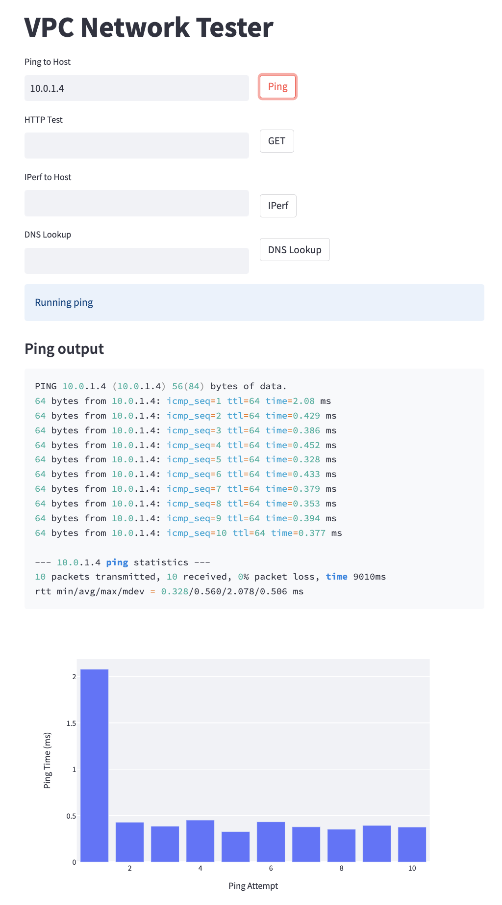
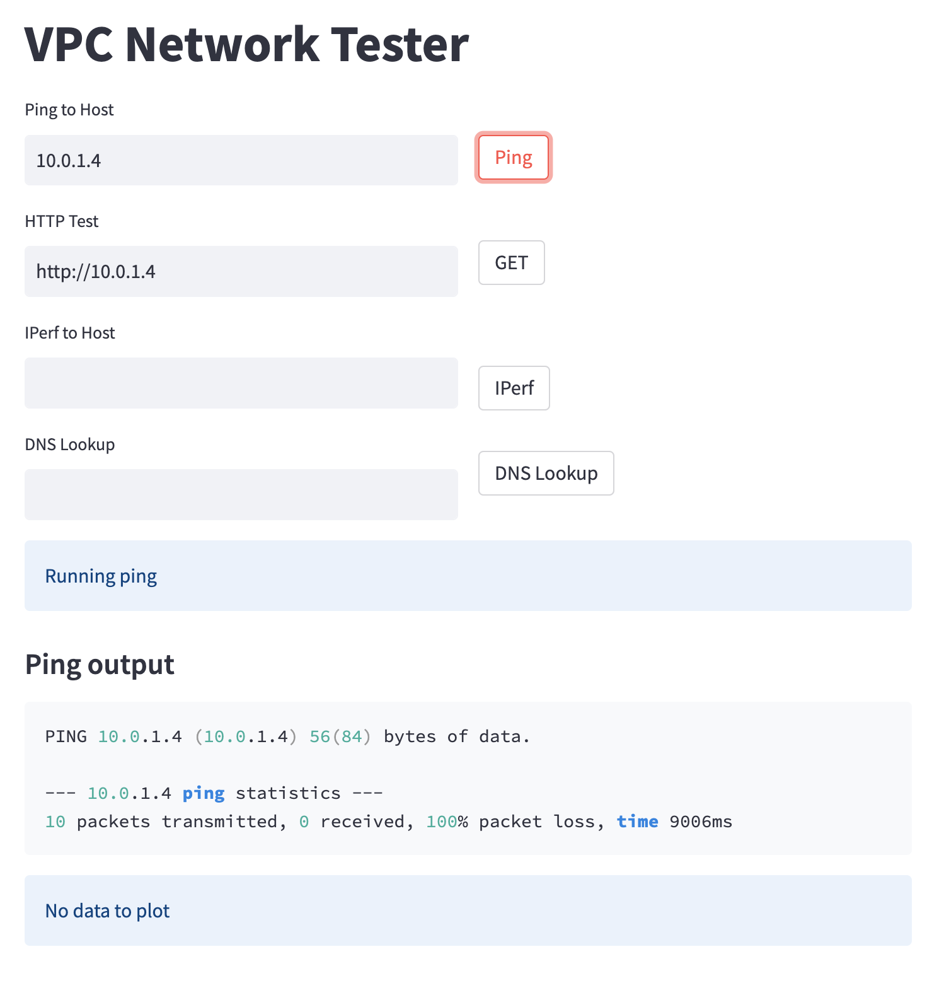
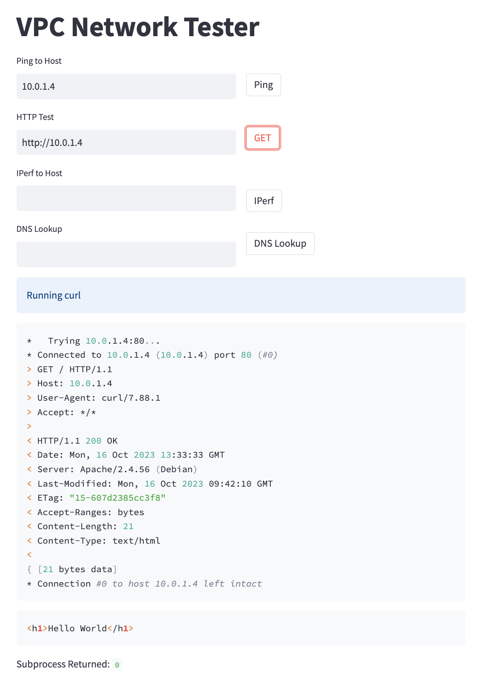
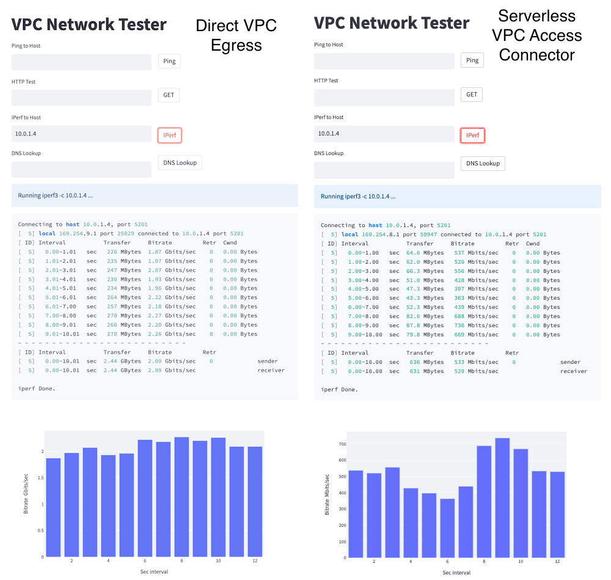
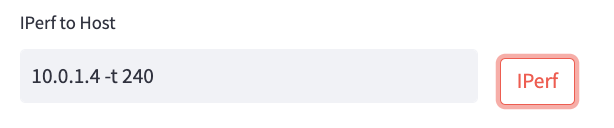
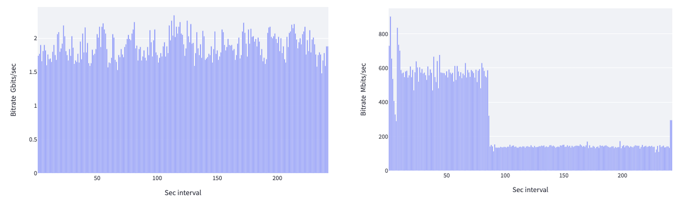
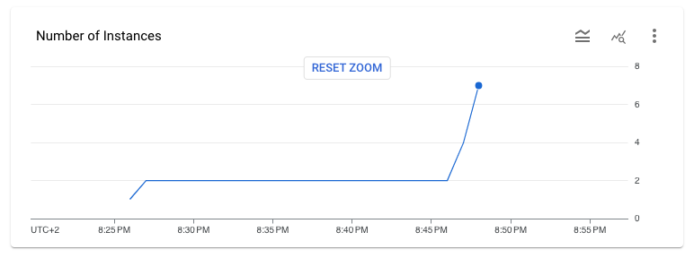

# Direct VPC Egress tutorial

_Authors: [Guillermo Palacín](https://github.com/willypalacin) & [Javier Cañadillas](https://github.com/javiercanadillas)_

## Introduction

The purpose of this tutorial is to provide a hands-on guide of the options available to connect  **Cloud Run services to private resources** that sit on a VPC network. This type of connection is known as _egress connectivity_, an example of such being Cloud Run establishing a private connection to a virtual machine (VM) running on Google Compute Engine (GCE) or to a Cloud SQL instance.

Currently, there are two ways to accomplish it:

1. **Serverless VPC Access:** Until now this was the only available option in Google Cloud Platform (GCP). It works by setting up a connector that consists of a group of VM instance, their type depending on the throughput needed. This connector acts as a proxy between the Cloud Run service application and the resources in the VPC network that the service wants to connect to.

2. **Direct VPC Egress:** This is a new feature launched in Public Preview on August 15th 2023. It makes it possible for the Cloud Run service to connect to resources that sit on a VPC by directly assigning them an internal IP from the VPC subnet. This enables a new direct network path for communication, which allows for more throughput, no extra hops and lower latency. Also, it reduces the overall costs as there are underlying VMs implementing the connector.

In this setup, you will go through the steps to configure both connectivity options. The lab materials provide network diagnostic tools to highlight the differences between Direct VPC Egress and Serverless VPC Access Connector. 

The following architecture diagram depicts the setup you will be creating:

- VPC with a subnet in a supported Cloud Region
- Cloud Run public service using the VPC Egress feature
- Cloud Run public service using the VPC Serverless Access Connector in the same region
- Compute Engine instance acting as a web server, where you will use `tcpdump` to analyze incoming network traffic

<p align="center">
  
  <div align="center">
    <small>Lab Architecture</small>
  </div>
</p>

### Serveless VPC Access Connector

As mentioned, Serverless VPC Access is one of the ways to connect privately to a Virtual Private Cloud (VPC) network from a GCP serverless environment such as Cloud Run.

Serverless VPC Access is based on a resource called a *connector*, which is a group of instances attached to an specific VPC and Cloud Region. Depending on the desired throughput for the connection between the service and the VPC, you may choose diferent machine type in the VPC Serverless aceess connector:

| Machine type | Estimated throughput range in Mbps |
|---|---|
| f1-micro | 100-500 |
| e2-micro | 200-1000 |
| e2-standard-4 | 43200-16000 |

You may refer to the official documentation for more information on the [Serverless VPC Access Connector](https://cloud.google.com/vpc/docs/serverless-vpc-access#scaling) and up to date information regarding throughput numbers.

Serverless VPC Access can automatically increase the number of instances in your connector as traffic increases. You can specify the minimum and maximum number of connector instances allowed. The minimum must be at least 2 and the maximum can be at most 10.

In terms of networking a **/28 CIDR range** needs to be assigned to the connector.  Make sure that it does not overlap with any other CIDR ranges that are already in use on your network. Traffic that is sent through the connector into your VPC network will originate from the subnet or CIDR range that you specify, acting as a proxy as you will see later in this guide.

### Direct VPC Egress

This feature allows the Cloud Run service to get an IP directly on the subnet without the need of having underlying VMs acting as connectors. Since the connectivity to the VPC is direct, this optionn have the folllowing benefits:

- **Lower latency and  higher throughput** by way of eliminating the need for connectors, which add extra hops in the network path.
- **Cost reduction** since there's no need to pay for underliying instance to establish the connection  
- **Granular network security**, thanks to using network tags directly on Cloud Run. 

>>   **Note:**
>>   As at the time of writing this guide Direct VPC Egress is in Public preview, which means you may incur some limitations if the    service is still in Preview at the time of you following these instructions.
>>
>>  Some of the current limitations are: 
>>
>>  - It is only supported in the following regions:
>>      - us-central1
>>      - us-east1
>>      - europe-west1
>>      - europe-west3
>>      - asia-northeast1
>> - The maximum number of instances supported are 100.
>> - **No support for Cloud NAT** yet to exit to the internet through the VPC.


## Prerequisites 

Before starting, make sure you have the following requirements: 
1. A Google [Cloud Project](https://cloud.google.com/resource-manager/docs/creating-managing-projects#gcloud) with a billing account associated.
2. Shell environment with `gcloud` and `git`. Cloud Shell is recommended as it's convenient and it already has the required tools.

## Setting up the environment and infrastructure

1. Make sure you are authorized to use the Google Cloud SDK:

```bash
gcloud auth login
```

2. Clone this repository:

```bash
repo_name="cloud-run-direct-vpc-egress"
git clone "https://github.com/javiercanadillas/$repo_name.git"
cd "$repo_name"
```

Now, you've got two options to proceed with the creation of the infrastructure required by the lab. You can either set it up in a manual fashion using `gcloud` commands, or use a declarative Terraform configuration to automate the process. Each of these options is explained in detail by their own section below.

Choose one, follow the steps described in it, and then come back to this `README` to continue with the testing of the scenario you've built.

- [**Option 1** - Manual setup](./docs/manual-setup.md)
- [**Option 2** - Terraform setup](./docs/terraform-setup.md)

## Testing the scenario

Once you've setup the required infrastructure setup through one of the options described before, you can proceed to this section, where you will perform some connectivity tests and analyze the traffic egress for both services.

1. SSH into the packet sniffer instance:

```bash
gcloud compute ssh "$GCE_VM_NAME" \
  --zone "$ZONE" \
  --project "$GCP_PROJECT_ID" \
  --tunnel-through-iap
```

2. Once inside the machine, check that the sample web server is running by executing a simple `curl` command against localhost:

```bash
curl localhost
```

The output should be the following:

```text
<h1>Hello World</h1>
```

3. Use `tcpdump` to start listening for ICMP and HTTP traffic and leave it running:

```bash
sudo tcpdump -i ens4 -p tcp port 80 or icmp -n
```

4. While  the `tcpdump` is running, get the Cloud Run `direct-vpc-egress-service` URL from another terminal in your shell:

```bash
echo $CR_DIRECT_URL
echo $GCE_VM_IP
```

5. Copy the first output URL, open a new browser tab and paste it there.

6. The nettest app UI will be displayed. Enter the IP of the packet sniffer instance (should be the output of `echo $GCR_VM_IP`) into the "Ping to Host" field and click on the **Ping** button.

  This will run a ping test from the Cloud Run service to the private IP of the packet sniffer instance. The ping test will be successful, and you will see the results in the UI.

<p align="center">
  
  <div align="center">
    <small>Ping from the private IP of the packet sniffer instance to the GCE VM through Direct VPC Egress</small>
  </div>
</p>

6. Going back to the terminal where the `tcpdump` command is running, you should see an output similar to this:

```text
[...]
13:22:54.338839 IP 10.0.1.32 > 10.0.1.4: ICMP echo request, id 32682, seq 10, length 64
13:22:54.338869 IP 10.0.1.4 > 10.0.1.32: ICMP echo reply, id 32682, seq 10, length 64
[...]
```

This indicates that the request originated by the container comes from the IP `10.0.1.32`. This IP has been allocated directly from the region subnet `(10.0.1.0/24)`, so this means that the **Direct VPC Egress** is now working, originating packets from your VPC network.

Repeat the process with the Cloud Run service that has the **Serverless VPC Access Connector** enabled, leaving the `tcpdump` running on the GCE VM in the background.

7. Get the URL of the `vpc-access-connector-service` Cloud Run service:

```bash
echo $CR_CONNECTOR_URL
```

8. Open a new browser tab and paste the Cloud Run service URL, and repeat the ping test against the IP `10.0.1.4`, the private address of the packet sniffer instance.

<p align="center">
  
  <div align="center">
    <small>Ping from the private IP of the packet sniffer instance to the GCE VM through Serverless VPC Access Connector</small>
  </div>
</p>

This time, you can observe that the ping test is unsuccessful. This is because [ICMP is not a compatible protocol with Serverless VPC Access Connector](https://cloud.google.com/vpc/docs/serverless-vpc-access?hl=es-419#supported_networking_protocols).

However, an HTTP request works fine:

<p align="center">
  
  <div align="center">
    <small>HTTP request from the private IP of the packet sniffer instance to the GCE VM through Serverless VPC Access Connector</small>
  </div>
</p>

9. Go back to the packet sniffer instance running `tcpdump`, you should see something like this for the HTTP test:

```text
[...]
13:38:19.594016 IP 172.16.1.3.43880 > 10.0.1.4.80: Flags [F.], seq 73, ack 249, win 16384, options [nop,nop,TS val 1725674610 ecr 205549904], length 0
[...]
```

In this case, the origin IP making the request does not come from our subnet but from the **Serverless VPC Access Connector** IP range allocated (172.16.1.0/28). As expected, the *connector* acts a a proxy breaking the connection.

## Benchmarking the different configurations
Now that you have the whole testing scenario set up, you can benchmark the different configurations and run several `iperf` tests to the `packet-sniffer` VM to measure the network throughput using each of the configurations.

### Test 1: Direct VPC Egress vs Serverless VPC Access Connector (2 instances)

>>   **Note:**
>>   You set up the serverless VPC Access Conector with a minimum of 2 instances and a  maximum of 10. As you will see, for the first test, the Serverless Access Connector has two instances, something you can see in if you go to the connector details page in https://console.cloud.google.com/networking/connectors/details/europe-west1/$CONNECTOR_NAME?project=$GCP_PROJECT_ID

Go back to the browser tab where you opened the `$CR_DIRECT_URL` Cloud Run Service and launch a test against the `packet-sniffer` VM IP address. Do the same thing for the `$CR_CONNECTOR_URL` Cloud Run service.

As shown in the image below, the throughput using the Direct VPC Egress Setting is much higher, averaging **2.09 Gbps**, compared to **575 Mbps** when using the Serverless Access Connector with 2 instances.

<p align="center">
  
  <div align="center">
    <small>Left image shows an iPerf test using Direct VPC Egress while the right uses Serverless VPC Access connector with two instances</small>
  </div>  
</p>

### Test 2:  Direct VPC Egress vs Serverless VPC Access Connector (more instances)

In this scenario, you will be increasing the duration of the test to assess the autoscaling capabilities of both the Serverless VPC Access Connector and the Direct VPC Egress across 4 minutes of sustained load.

Go back to the browser tab where you opened the `$CR_DIRECT_URL` Cloud Run Service and launch an iPerf test to the `packet-sniffer` VM IP address. This time, increase the duration of the test to 4 minutes by appending the `-t 240` flag in the iPerf command field after the IP address:

<p align="center">
  
</p>

Do the same thing for the `$CR_CONNECTOR_URL` Cloud Run service, and launch an iPerf test appending the `-t 240` flag after the IP address.

<p align="center">
  
  <div align="center">
    <small>Direct VPC Egress vs Serverless VPC Access Connector with 240 samples.</small>
  </div>  
</p>

As shown in the image above, you can see that Direct VPC Egress achieved similar performance to the previous scenario, with a bitrate of **1.87 Gbps** and a quite uniform distribution across the 240 samples. In contrast, the Serverless VPC Access Connector exhibited a bit more variance, with a median bitrate of around **500 Mbps.** Due to scaling issues, there's a considerable drop of the bitrate after 80 seconds, which starts to recover almost at the end of the graph once the Serverless connector has scaled up.

As a consequence of the 4 minute stress test, the Serverless VPC Access Connector has scaled its number of instances up to 6, as shown in the Serverless VPC Access connector details page in the Google Cloud Console (`https://console.cloud.google.com/networking/connectors/details/europe-west1/$CONNECTOR_NAME?project=$GCP_PROJECT_ID`):

<p align="center">
  
  <div align="center">
    <small>Scale up of the Serverless VPC Access Connector with requests pressure</small>
  </div>  
</p>

### Test 3:  Load testing to see the effect on response times

For this scenario, you will be sending traffic from the Packet Sniffer Compute Engine VM to both services deployed on Cloud Run. 

The goal is to test if there is a difference in response times due to bandwidth constraints when a large number of requests overload a considerable number of instances using the two different network paths.
As a consequence of the load, the number of Cloud Run instances will increase.

You will be using Hey, which is a tiny program that sends load to a web application. 

1. First, reconfigure Cloud Run to allow 5 concurrent requests per instance.

```bash
gcloud run services update $CR_DIRECT_SERVICE_NAME --concurrency 5
gcloud run services update $CR_CONNECTOR_SERVICE_NAME --concurrency 5
```

2. Then, connect via SSH to the **Packet Sniffer VM** and run the following commands:

```bash
hey -z 100s -c 30 <URL of direct VPC Egress service> 
hey -z 100s -c 30 <URL of VPC Serverless Access Connector service> 
```
- `-c` option specifies the number of workers to run concurrently; in this case, it will be 30.
- `-z` specifies the duration of the application to send requests. When the duration is reached, the application stops and exits. In this case, it will be running for 100 seconds.

<p align="center">
  
  <div align="center">
    <small>Load testing response times</small>
  </div>
</p>

As shown in the image above, during the test the number of instances of each one of the Cloud Run services increases as more load is injected. You can see that even though the average response time is similar to that of the Direct VPC Egress service, there is a long tail of responses that took considerably longer in the Serverless VPC Access service. Nevertheless, this test should not be regarded as well built, as there exist other factors beyond networking that influence response delays, such as the duration in milliseconds required for a cold start to initiate the instance. As shown in the image above the distribution of scaled instances is approximately uniform, but not entirely equal.

### Wrapping up

Direct VPC Egress is here to stay and has a promising future. It provides a more native way to set up connectivity between Cloud Run Services and private resources, offering some advantages over Serverless VPC Access. Direct VPC Egress is easier to set up, faster, and can handle more traffic. Not having to manage underlying VM instances allows for granular control, improves reliability, and decreases the cost of maintaining instances. Enhanced security granularity is also achieved with this setting by being able to attach tags directly to the Cloud Run service.

The absence of certain functionalities and the 100 instances limitation in this preview version implies however that Serverless VPC Access Connector remains essential for some scenarios —such as internet egress conectivity. This is due to Direct VPC Egress not having support for Cloud NAT, VPC Flow logs or Firewall Rules logging.

Here is a summary comparison of Direct VPC Egress and Serverless VPC Access connector:

| Feature | Direct VPC Egress | Serverless VPC Access Connector |
|---|---|---|
| Latency | Lower | Higher |
| Throughput | Higher | Lower |
| IP allocation | Uses more IP addresses in most cases | Uses fewer IP addresses |
| Cost | No additional VM charges | Incurs additional VM charges |
| Scaling speed | Instance autoscaling is slower during traffic surges while new VPC network interfaces are created. | Network latency occurs during VPC network traffic surges while more connector instances are created. |
| Google Cloud console | Supported | Supported |
| Google Cloud CLI | Supported | Supported |
| Launch stage | Preview (see [Limitations](https://cloud.google.com/run/docs/configuring/vpc-connect-comparison#limitations)) | GA (production-ready) |
