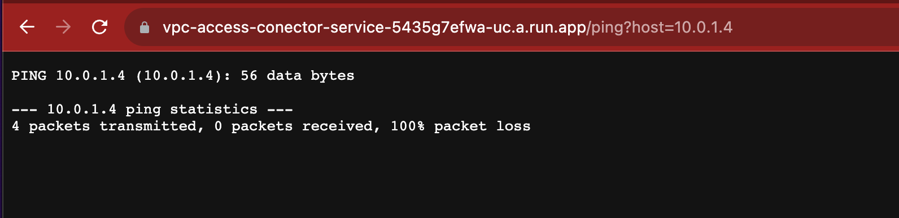

# Direct VPC Egress tutorial

The purpose of this tutorial is to provide a hands-on guide of the options available to connect  **Cloud Run services to private resources** that sit on a VPC network. This kind of connection is known as egress connectivity, an example of such being Cloud Run establishing a private connection to a VM running on Google Compute Engine or to a Cloud SQL instance. 

Currently, there are two ways to accomplish it:

1. **Serverless VPC Access:** This was the traditional way —and the only way available in Google Cloud Platform, until the moment of the writing of this doc. It works by setting up a connector that consists of a group of VM instances of several types that depends on the throughput needed. This connector acts as a proxy between the Cloud Run service application and the resources in the VPC network that the service wants to connect to.

2. **Direct VPC Egress:** This is a new feature launched in Public Preview on August 15th 2023. It makes it possible for the Cloud Run service to connect to resources that sit on a VPC by directly assigning them an internal IP from the VPC subnet. This enables a new direct network path for communication, which allows for more throughput, no extra hops and lower latency.

In this setup, you will cogo through the steps to configure both connectivity options. The lab materials provide network diagnostic tools to highlight the differences between Direct VPC Egress and Serverless VPC Access. 

The lab steps rely on the following architecture diagram, that includes the following components:

- VPC with a subnet in us-central1
- Cloud Run public service using the VPC Egress feature
- Cloud Run public service using the VPC Serverless Access Connector in us-central1
- Compute Engine instance acting as a webserver, where we will use tcpdump to analyze incoming network traffic


*Lab architecture*

## Prerequisites 
Before starting make sure you have the following requirements: 
1. A Google [Cloud Project](https://cloud.google.com/resource-manager/docs/creating-managing-projects#gcloud) with a billing account associated.
2. Shell environment with `gcloud` and `git`. Cloud Shell is recommended as it already has the required tools installed.

## Initial setup

1. Make sure you are authorized to use the Google Cloud SDK:

```bash
gcloud auth login
```

2. Define the variables you will use along the lab:

```bash
export PROJECT_ID=<PROJECT_ID> # Replace with your project ID
export REGION=europe-west1 # Feel free to change it to the region of your choice where the feature is available
export ZONE=europe-west1-b # Feel free to change it to an existing zone in the region you chose before
export VPC_NAME=vpc-producer
```

3. Configure the project:

```bash
gcloud config set project $PROJECT_ID
```

4. Enable the required APIs::

```bash
gcloud services enable run.googleapis.com \
  compute.googleapis.com \
  artifactregistry.googleapis.com \
  vpcaccess.googleapis.com \
  networkmanagement.googleapis.com
```

### Create the VPC 

 As shown in the reference architecture, you will be creating a custom mode VPC with a subnet in `$REGION`` with a the 10.0.1.0/24 IP range.

```bash
gcloud compute networks create $VPC_NAME --subnet-mode=custom
gcloud compute networks subnets create "${VPC_NAME}-subnet-$REGION" --network=$VPC_NAME --region=$REGION --range=10.0.1.0/24
```

### Build the Tester Tool image
The lab uses the [VPC Network Tester image](https://github.com/GoogleCloudPlatform/vpc-network-tester) from the official Google Cloud GitHub Repository. This tool deploys a simple website in Cloud Run so anyone can perform connectivity tests from Cloud Run through a graphical UI.

You will need to build the image and push it to Artifact Registry:

1. Clone the repository from Github: 

```bash
git clone https://github.com/GoogleCloudPlatform/vpc-network-tester
cd vpc-network-tester/cloudrun
``` 

2. Create a Docker repository in Artifact Registry to store the image:
```bash
gcloud artifacts repositories create cloud-run-lab \
--repository-format=docker \
--location=$REGION --description="Docker repo to store the images"
```

3. Build the docker image Cloud Build and push it to Artifact Registry:
```bash
gcloud builds submit -t $REGION-docker.pkg.dev/$PROJECT_ID/cloud-run-lab/network-tester . 
```

### Deploying to Cloud Run 

#### Deploying a service using Direct VPC Egress

You'll start by deploying the Direct VPC Egress service.

As mentioned before, this feature allows the Cloud Run service to get an IP directly on the subnet without the need of having underlying VMs acting as connectors. Since the connectivity to the VPC is direct, this option have the folllowing benefits:

- **Lower latency and  higher throughput** by way of eliminating the need for connectors, which add extra hops in the network path.
- **Cost reduction** since there's no need to pay for underliying instance to establish the connection  
- **Granular network security**, thanks to using network tags directly on Cloud Run. 

>>   **Note:**
>>   As at the time of writing this guide Direct VPC Egress is in Public preview, which means you may incur some limitations if the    service is still in Preview at the time of you following these instructions.
>>
>>  Some of the current limitations are: 
>>
>>  - It is only supported in the following regions:
>>      - us-central1
>>      - us-east1
>>      - europe-west1
>>      - europe-west3
>>      - asia-northeast1
>> - The maximum number of instances supported are 100.
>> - **No support for Cloud NAT** yet to exit to the internet through the VPC.

Execute the following comand to deploy Cloud Run with VPC Egress setting. Requests to private address or internal DNS will henceforth routed to the VPC.

```bash
gcloud beta run deploy direct-vpc-egress-service \
  --image="${REGION}-docker.pkg.dev/${PROJECT_ID}/cloud-run-lab/network-tester" \
  --network=$VPC_NAME \
  --subnet="${VPC_NAME}-subnet-${REGION}" \
  --network-tags=service-direct-egress \
  --region=$REGION \
  --vpc-egress=private-ranges-only \
  --allow-unauthenticated
```

In case you want all the request to be directed to the VPC —not only the ones targeting private addresses— you may deploy the Cloud Run service using the setting `--vpc-egress=all` instead.

#### Deploying a service using the Serverless VPC Access Connector

As mentioned in the initial sections of this doc, Serverless VPC Access is the traditional way to connect privately to a Virtual Private Cloud (VPC) network from a GCP serverless environment such as Cloud Run.

Serverless VPC Access is based on a resource called a *connector*, which is a group of instances attached to an specific VPC and Cloud Region. Depending on the desired throughput for the connection between the service and the VPC, you may choose diferent machine type in the VPC Serverless aceess connector:

| Machine type | Estimated throughput range in Mbps |
|---|---|
| f1-micro | 100-500 |
| e2-micro | 200-1000 |
| e2-standard-4 | 43200-16000 |

You may refer to the official documentation for more information on the [Serverless VPC Access Connector](https://cloud.google.com/vpc/docs/serverless-vpc-access#scaling) and up to date information regarding throughput numbers.

Serverless VPC Access can automatically increase the number of instances in your connector as traffic increases. You can specify the minimum and maximum number of connector instances allowed. The minimum must be at least 2 and the maximum can be at most 10.

In terms of networking a **/28 CIDR range** needs to be assigned to the connector.  Make sure that it does not overlap with any other CIDR ranges that are already in use on your network. Traffic that is sent through the connector into your VPC network will originate from the subnet or CIDR range that you specify, acting as a proxy as you will see later in this guide.

1. Configure the Serverless VPC Access Connector:

```bash
gcloud compute networks vpc-access connectors create "connector-$VPC_NAME" \
--network=$VPC_NAME \
--region=$REGION \
--range=172.16.1.0/28 \
--min-instances=2 \
--max-instances=5 \
--machine-type=e2-micro 
```

2. Deploy the VPC Network Tester image in a new Cloud Run service using the serverless VPC Accesss Connector and make it publicly accessible:

```bash
gcloud run deploy vpc-access-conector-service \
--image="${REGION}-docker.pkg.dev/${PROJECT_ID}/cloud-run-lab/network-tester" \
--vpc-connector="connector-$VPC_NAME" \
--region=$REGION \
--allow-unauthenticated
```

### Create the VM in the VPC

You will now create a VM instance with a private IP 10.0.1.4 in the us-central-1 subnet to serve the following purposes for the lab: 

- Act as a web server for testing HTTP requests from the two Cloud Run services.
- Run `tcpdump` to capture network traffic.

```bash
gcloud compute instances create packet-sniffer \
--tags=vpc-producer-server \
--subnet="${VPC_NAME}-subnet-${REGION}" \
--zone=$ZONE \
--private-network-ip=10.0.1.4 \
--metadata startup-script='#!/bin/bash
sudo su -
apt update
apt install apache2 -y
echo "<h1>Hello World</h1>" > /var/www/html/index.html'
```

### Create the firewall rules
The last step to finish the setup is to create the required firewall rules to allow ICMP (ping) and HTTP(S) between the Cloud Run service and the server running in the VPC.

1. Create the following rule to allow HTTP and ICMP connectivity between the `direct-vpc-egress-service` and the `packet-sniffer` instance. One of the main advantages you gain from using Direct VPC Egress is that we can use network tags  attached to our cloud run service to the firewall rules:

```bash
gcloud compute firewall-rules create allow-http-icmp-vpcdirect-to-gce \
  --network=$VPC_NAME \
  --action=ALLOW \
  --direction=INGRESS \
  --source-tags=service-direct-egress \
  --target-tags=vpc-producer-server \
  --rules=tcp:80,icmp \
  --priority=900
```

In the case of the connection between the Cloud Run `vpc-access-connector-service` service and the `packet-sniffer` instance, an implicit firewall rule with priority 1000 is created on the VPC network to allow ingress from the connector's subnet or custom IP range to all destinations in the network. The implicit firewall rule is not visible in the Google Cloud console and exists only as long as the associated connector exists. 

However, the connector must be able to receive packets from the Google Cloud external IP address range 35.199.224.0/19. This rule will have to be configured explicit as a next step. Even though this range may seem like a public range, it is not publicly advertised and is used by underlying Google internal infrastructure to ensure that services from Cloud Run can send packets to the connector.

2. Configure the aforementioned firewall rule:
```bash
gcloud compute firewall-rules create internal-to-vpc-connector \
--action=ALLOW \
--rules=TCP \
--source-ranges=35.199.224.0/19 \
--target-tags=vpc-connector \
--direction=INGRESS \
--network=$VPC_NAME \
--priority=980
```

>>**Note**: `vpc-connector` is the universal connector network tag used to make the rule apply to all connectors in the VPC network.

3. Lastly, in order to enable administrative ssh access from the Cloud Shell to our VM instance we need to allow ssh from the IAP range:
```bash
gcloud compute firewall-rules create allow-ssh-ingress-from-iap \
  --direction=INGRESS \
  --network=$VPC_NAME \
  --action=allow \
  --rules=tcp:22 \
  --source-ranges=35.235.240.0/20
```

### Test the scenario

Now that we have our scenario up and running, it is time to perform some connectivity tests and analyze the traffic egress for both services.

- Access via SSH to the packet sniffer instance:

```bash
gcloud compute ssh --zone $ZONE "packet-sniffer" --project $PROJECT_ID
```

- Once inside the machine, you can test that our sample web server is running by executing a simple `curl` command against localhost

```bash
$ curl localhost
<h1>Hello World</h1>
```

- The next step is to start listening for ICMP and HTTP traffic using `tcpdump` and leave it running:

```bash
$ sudo tcpdump -i ens4 -p tcp port 80 or icmp -n
```

- While `tcpdump` is running in the machine, let's open a web browser and open the Cloud Run services URL. To get it, you can run the following command from the shell. Let's start first with the container with the **Direct VPC Egress** setting enabled:

```bash
gcloud run services describe direct-vpc-egress-service --region=$REGION
```
- Copy the URL and paste it into a browser.

As shown in the image below, we will run a ping test and HTTP to the private IP of the sniffer instance (10.0.1.4).


- If we go back to the instance terminal, we should see something like this:

```bash
···15:24:23.711908 IP 10.0.1.16.40719 > 10.0.1.4.80: ···
```

This indicates that the request originated by the container comes from the 10.0.1.16. The IP has been allocated directly from our `us-central1` subnet `(10.0.1.0/24)`. Therefore, we can conclude that the **Direct VPC Egress** setting works properly, originating packets from our VPC network.

Let's repeat the process with the **Serverless VPC Access Connector** enabled.

- Run this command to get the URL of the `vpc-access-connector-service  ` Cloud Run service:

```bash
gcloud run services describe vpc-access-connector-service --region=$REGION
```

- Following the previous steps, let's open the URL in a browser and run a ping and HTTP test to the private IP of the packet sniffer instance (10.0.1.4).

In this time, we can observe that the ping test is unsuccessful while the HTTP works fine. Later in the next section,  we will see why (TBD in next section).

- Let's go back to the packet sniffer instance running `tcpdump`, we should see something like this for the HTTP test:

```bash
15:34:28.817869 IP 172.16.1.3.38388 > 10.0.1.4.80:
```

In this case, the origin IP making the request does not come from our subnet but from the **Serverless VPC Access Connector** IP range allocated (172.16.1.0/28). As expected, the *connector* acts a a proxy breaking the connection. 

### Performing connectivity test from Network Intelligence Center

[Network Intelligence Center (NIC)](https://cloud.google.com/network-intelligence-center) provides a single console for managing Google Cloud network visibility, monitoring, and troubleshooting.

One of the modules is [Connectivity Tests](https://cloud.google.com/network-intelligence-center/docs/connectivity-tests/concepts/overview). Connectivity Tests is a diagnostics tool that lets you check connectivity between network endpoints. It analyzes your configuration and in some cases, performs live data plane analysis between the endpoints. An endpoint is a source or destination of network traffic, such as a VM, a GKE cluster, or a Cloud Run service. The tool simulates the expected forwarding path of a packet through your Virtual Private Cloud (VPC) network, Cloud VPN tunnels, or VLAN attachments.

To create a network test in the Google Cloud Console (UI):

```bash
Networking > Network Intelligence > Connectivity Tests
```

**TBD - pending allowlisting - tests are not ready yet with the Direct VPC Egress settingç**

**TBD - Pings and other traffic are restricted in the VPC Serverless Access connector** See https://cloud.google.com/network-intelligence-center/docs/connectivity-tests/states/reasons-dropped-packets?&_ga=2.65729390.-1339829605.1686908106#traffic-type-blocked

### Conclusions

Direct VPC Egress is here to stay and has a promising future. It provides an  easy way to set up connectivity between Cloud Run Services and private resources, offering multiple advantages over Serverless VPC Access. Direct VPC egress is easier to set up, faster, and can handle more traffic. Not having to manage underlying VM instances allows for granular control, improves reliability, and decreases the cost of maintaining instances. Enhanced security granularity is also achieved with this setting by being able to attach tags directly to the Cloud Run service.

Nonetheless, the absence of certain functionalities and the 100 instances limitatio in this preview version, implies that Serverless VPC Access Connector remains essential for some scenarios —such as internet egress conectivity. This is due to its lack of support for Cloud NAT, VPC Flow logs and Firewall Rules logging.


Here is a comparison of Direct VPC egress and Serverless VPC Access connector:

| Feature | Direct VPC egress | Serverless VPC Access connector |
|---|---|---|
| Latency | Lower | Higher |
| Throughput | Higher | Lower |
| IP allocation | Uses more IP addresses in most cases | Uses fewer IP addresses |
| Cost | No additional VM charges | Incurs additional VM charges |
| Scaling speed | Instance autoscaling is slower during traffic surges while new VPC network interfaces are created. | Network latency occurs during VPC network traffic surges while more connector instances are created. |
| Google Cloud console | Supported | Supported |
| Google Cloud CLI | Supported | Supported |
| Launch stage | Preview (see [Limitations](https://cloud.google.com/run/docs/configuring/vpc-connect-comparison#limitations)) | GA (production-ready) |
